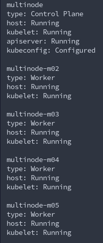

## Задание D2.4.1

При помощи [terraform](terraform/) на YA cloud разворасиваем host
При помщи [ansible](ansible/) устанавливаем docker и minikube 

далее заходим на хост и запускаем команду
`minikube start --nodes 5 -p multinode`

проверяем статус запущенных nodes
`minikube status -p multinode`

#### вывод команды

